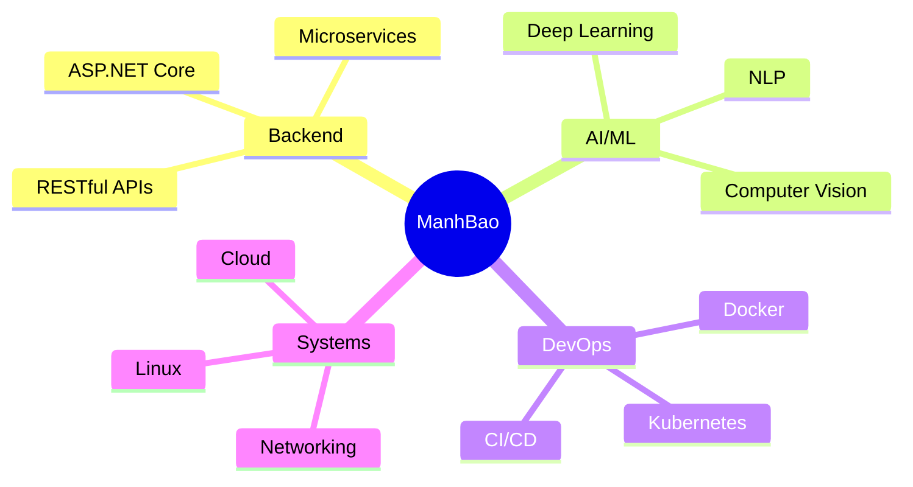

# 👋 Xin chào, tôi là ManhBao!

<div align="center">
  
  
  
</div>

## 🚀 Về tôi

```csharp
var developer = new Developer
{
    Name = "ManhBao",
    Location = "Vietnam 🇻🇳",
    CurrentFocus = new[] { "ASP.NET Core", "AI/ML", "DevOps" },
    LearningGoals = new[] { "Microservices", "Cloud Architecture", "Deep Learning" },
    Interests = new[] { "Web Development", "Artificial Intelligence", "Linux Systems" },
    FunFact = "I turn coffee into code ☕ → 💻"
};
```

## 🛠️ Tech Stack

### 💻 Languages


### 🌐 Frameworks & Libraries


### 🤖 AI & Machine Learning


### 🗄️ Databases


### 🐧 DevOps & Linux


### ☁️ Cloud & Tools


## 📊 GitHub Stats

<div align="center">
  
  
</div>

<div align="center">
  
</div>

## 🏆 GitHub Trophies
<div align="center">
  
</div>

## 📌 Featured Projects

<div align="center">
  
[](https://github.com/mabu0410/StudentManagement)

</div>

## 🎯 Current Focus



## 🤝 Connect with me

<div align="center">
  
[](mailto:vumanhbao0411@gmail.com)
[](https://github.com/mabu0410)
[](https://linkedin.com/in/)

</div>

---

<div align="center">
  
  
  
  ### 💡 "Code is like humor. When you have to explain it, it's bad." – Cory House
  
  ⭐ **From [mabu0410](https://github.com/mabu0410)** with ❤️
  
</div>
